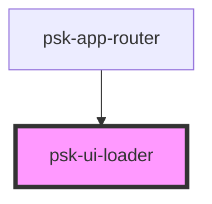

# psk-ui-loader

<!-- Auto Generated Below -->

## Properties

| Property           | Attribute            | Description | Type      | Default |
| ------------------ | -------------------- | ----------- | --------- | ------- |
| `shouldBeRendered` | `should-be-rendered` |             | `boolean` | `false` |

## Dependencies

### Used by

 - [psk-app-router](../psk-app-router)

### Graph

----------------------------------------------

*Made by [WebCardinal](https://github.com/webcardinal) contributors.*
