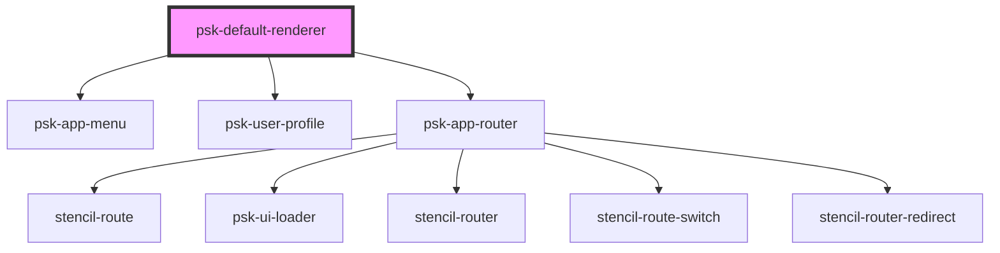

# psk-default-renderer

<!-- Auto Generated Below -->

## Properties

| Property         | Attribute         | Description | Type      | Default |
| ---------------- | ----------------- | ----------- | --------- | ------- |
| `disableSidebar` | `disable-sidebar` |             | `boolean` | `false` |
| `mobileLayout`   | `mobile-layout`   |             | `boolean` | `false` |

## Events

| Event           | Description | Type               |
| --------------- | ----------- | ------------------ |
| `getAppVersion` |             | `CustomEvent<any>` |

## Dependencies

### Depends on

- [psk-app-menu](../../psk-app-menu)
- [psk-user-profile](../../psk-user-profile)
- [psk-app-router](../../psk-app-router)

### Graph

----------------------------------------------

*Made by [WebCardinal](https://github.com/webcardinal) contributors.*
