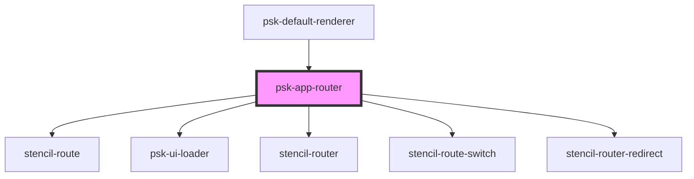

# psk-app-router

<!-- Auto Generated Below -->

## Properties

| Property      | Attribute      | Description | Type                             | Default     |
| ------------- | -------------- | ----------- | -------------------------------- | ----------- |
| `historyType` | `history-type` |             | `"browser" \| "hash" \| "query"` | `undefined` |
| `routesItems` | --             |             | `MenuItem[]`                     | `[]`        |

## Events

| Event                  | Description | Type               |
| ---------------------- | ----------- | ------------------ |
| `getCustomLandingPage` |             | `CustomEvent<any>` |
| `getHistoryType`       |             | `CustomEvent<any>` |
| `needRoutes`           |             | `CustomEvent<any>` |

## Dependencies

### Used by

 - [psk-default-renderer](../renderers/app-root-renders)

### Depends on

- stencil-route
- [psk-ui-loader](../psk-ui-loader)
- stencil-router
- stencil-route-switch
- stencil-router-redirect

### Graph

----------------------------------------------

*Built with [StencilJS](https://stenciljs.com/)*
