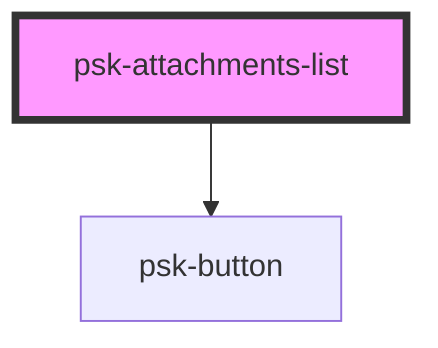

# psk-attachments-list

<!-- Auto Generated Below -->

## Properties

| Property            | Attribute             | Description | Type      | Default     |
| ------------------- | --------------------- | ----------- | --------- | ----------- |
| `attachmentsClass`  | `attachments-class`   |             | `string`  | `""`        |
| `files`             | `files`               |             | `any`     | `undefined` |
| `noAttachmentsText` | `no-attachments-text` |             | `string`  | `undefined` |
| `readOnly`          | `read-only`           |             | `boolean` | `false`     |

## Dependencies

### Depends on

- [psk-button](../psk-button)

### Graph

----------------------------------------------

*Built with [StencilJS](https://stenciljs.com/)*
