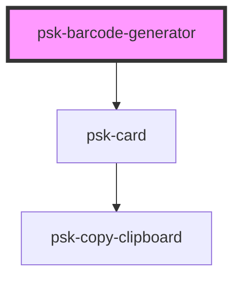

# psk-barcode-generator

<!-- Auto Generated Below -->

## Properties

| Property      | Attribute      | Description | Type      | Default     |
| ------------- | -------------- | ----------- | --------- | ----------- |
| `data`        | `data`         |             | `any`     | `undefined` |
| `includeText` | `include-text` |             | `boolean` | `false`     |
| `size`        | `size`         |             | `any`     | `32`        |
| `title`       | `title`        |             | `string`  | `""`        |
| `type`        | `type`         |             | `string`  | `"qrcode"`  |

## Dependencies

### Depends on

- [psk-card](../../psk-card)

### Graph

----------------------------------------------

*Built with [StencilJS](https://stenciljs.com/)*
