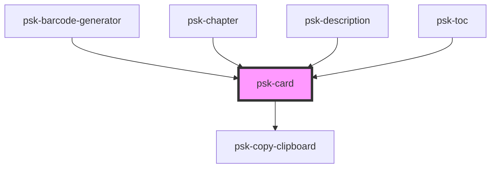

# psk-card

<!-- Auto Generated Below -->

## Properties

| Property | Attribute | Description | Type     | Default |
| -------- | --------- | ----------- | -------- | ------- |
| `id`     | `id`      |             | `string` | `""`    |
| `title`  | `title`   |             | `string` | `""`    |

## Dependencies

### Used by

 - [psk-barcode-generator](../psk-barcode/psk-barcode-generator)
 - [psk-chapter](../psk-chapter)
 - [psk-description](../psk-description)
 - [psk-toc](../psk-toc)

### Depends on

- [psk-copy-clipboard](../psk-copy-clipboard)

### Graph

----------------------------------------------

*Built with [StencilJS](https://stenciljs.com/)*
