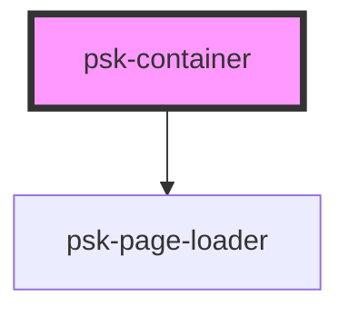

# my-component

<!-- Auto Generated Below -->

## Properties

| Property         | Attribute         | Description | Type            | Default     |
| ---------------- | ----------------- | ----------- | --------------- | ----------- |
| `controllerName` | `controller-name` |             | `string`        | `undefined` |
| `history`        | --                |             | `RouterHistory` | `undefined` |
| `htmlFilePath`   | `html-file-path`  |             | `string`        | `undefined` |
| `parentCallback` | --                |             | `Function`      | `undefined` |

## Dependencies

### Depends on

- [psk-page-loader](../psk-page-loader)

### Graph

----------------------------------------------

*Built with [StencilJS](https://stenciljs.com/)*
