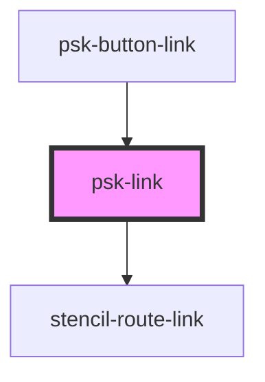

# psk-link

<!-- Auto Generated Below -->

## Properties

| Property  | Attribute | Description | Type     | Default     |
| --------- | --------- | ----------- | -------- | ----------- |
| `chapter` | `chapter` |             | `string` | `undefined` |
| `page`    | `page`    |             | `string` | `undefined` |
| `tag`     | `tag`     |             | `string` | `undefined` |

## Events

| Event         | Description | Type               |
| ------------- | ----------- | ------------------ |
| `getTags`     |             | `CustomEvent<any>` |
| `validateUrl` |             | `CustomEvent<any>` |

## Dependencies

### Used by

 - [psk-button-link](../psk-button-link)

### Depends on

- stencil-route-link

### Graph

----------------------------------------------

*Built with [StencilJS](https://stenciljs.com/)*
