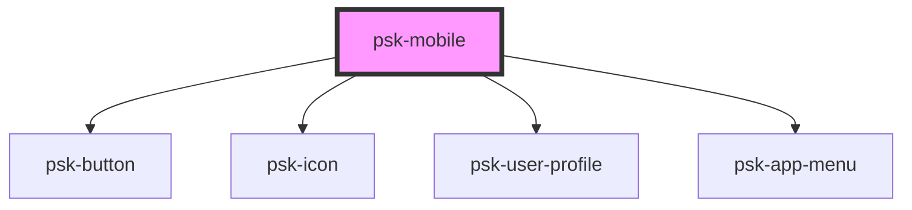

# psk-mobile

<!-- Auto Generated Below -->

## Properties

| Property         | Attribute         | Description | Type            | Default     |
| ---------------- | ----------------- | ----------- | --------------- | ----------- |
| `controllerName` | `controller-name` |             | `string`        | `undefined` |
| `disableHeader`  | `disable-header`  |             | `boolean`       | `false`     |
| `disableSidebar` | `disable-sidebar` |             | `boolean`       | `false`     |
| `enableBack`     | `enable-back`     |             | `boolean`       | `false`     |
| `history`        | --                |             | `RouterHistory` | `undefined` |
| `title`          | `title`           |             | `string`        | `''`        |

## Methods

### `toggleOptions(visible: any) => Promise<void>`

#### Returns

Type: `Promise<void>`

### `toggleSidebar(visible: any) => Promise<void>`

#### Returns

Type: `Promise<void>`

## Dependencies

### Depends on

- [psk-button](../psk-button)
- [psk-icon](../psk-icon)
- [psk-user-profile](../psk-user-profile)
- [psk-app-menu](../psk-app-menu)

### Graph

----------------------------------------------

*Built with [StencilJS](https://stenciljs.com/)*
