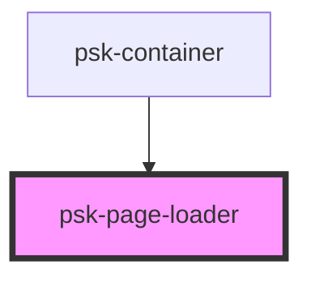

# psk-page-loader

<!-- Auto Generated Below -->

## Properties

| Property  | Attribute  | Description | Type     | Default     |
| --------- | ---------- | ----------- | -------- | ----------- |
| `pageUrl` | `page-url` |             | `string` | `undefined` |
| `type`    | `type`     |             | `string` | `"div"`     |

## Dependencies

### Used by

 - [psk-container](../psk-container)

### Graph

----------------------------------------------

*Built with [StencilJS](https://stenciljs.com/)*
