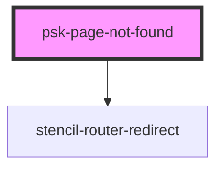

# psk-page-not-found

<!-- Auto Generated Below -->

## Properties

| Property         | Attribute         | Description | Type     | Default                         |
| ---------------- | ----------------- | ----------- | -------- | ------------------------------- |
| `basePath`       | `base-path`       |             | `string` | `undefined`                     |
| `pageRenderer`   | `page-renderer`   |             | `string` | `"psk-page-not-found-renderer"` |
| `urlDestination` | `url-destination` |             | `string` | `null`                          |

## Dependencies

### Depends on

- stencil-router-redirect

### Graph

----------------------------------------------

*Built with [StencilJS](https://stenciljs.com/)*
