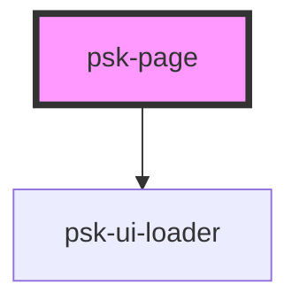

# psk-page

<!-- Auto Generated Below -->

## Properties

| Property               | Attribute                | Description | Type      | Default     |
| ---------------------- | ------------------------ | ----------- | --------- | ----------- |
| `badgeBackgroundColor` | `badge-background-color` |             | `string`  | `undefined` |
| `badgeText`            | `badge-text`             |             | `string`  | `undefined` |
| `badgeTextColor`       | `badge-text-color`       |             | `string`  | `undefined` |
| `hasToc`               | `has-toc`                |             | `boolean` | `false`     |
| `navigationTitle`      | `navigation-title`       |             | `string`  | `""`        |
| `pageClass`            | `page-class`             |             | `string`  | `""`        |
| `subTitle`             | `sub-title`              |             | `string`  | `""`        |
| `title`                | `title`                  |             | `string`  | `""`        |
| `tocTitle`             | `toc-title`              |             | `string`  | `undefined` |

## Dependencies

### Depends on

- [psk-ui-loader](../psk-ui-loader)

### Graph

----------------------------------------------

*Built with [StencilJS](https://stenciljs.com/)*
