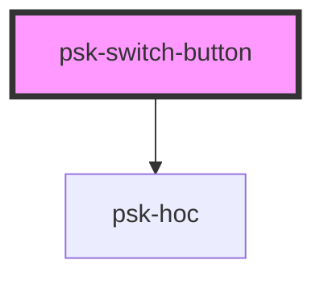

# psk-switch-button

<!-- Auto Generated Below -->

## Properties

| Property          | Attribute          | Description | Type     | Default     |
| ----------------- | ------------------ | ----------- | -------- | ----------- |
| `active`          | `active`           |             | `string` | `undefined` |
| `eventDispatcher` | `event-dispatcher` |             | `string` | `undefined` |
| `inactive`        | `inactive`         |             | `string` | `undefined` |
| `title`           | `title`            |             | `string` | `undefined` |
| `toggleEvent`     | `toggle-event`     |             | `string` | `undefined` |

## Dependencies

### Depends on

- [psk-hoc](../psk-hoc)

### Graph

----------------------------------------------

*Built with [StencilJS](https://stenciljs.com/)*
