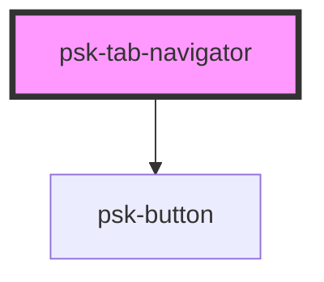

# psk-tab-navigator

<!-- Auto Generated Below -->

## Properties

| Property  | Attribute | Description | Type     | Default        |
| --------- | --------- | ----------- | -------- | -------------- |
| `default` | `default` |             | `number` | `0`            |
| `layout`  | `layout`  |             | `string` | `'horizontal'` |

## Dependencies

### Depends on

- [psk-button](../../psk-button)

### Graph

----------------------------------------------

*Built with [StencilJS](https://stenciljs.com/)*
