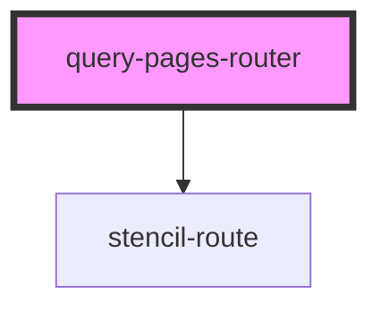

# query-pages-router

<!-- Auto Generated Below -->

## Properties

| Property     | Attribute     | Description | Type               | Default     |
| ------------ | ------------- | ----------- | ------------------ | ----------- |
| `history`    | --            |             | `RouterHistory`    | `undefined` |
| `location`   | --            |             | `LocationSegments` | `undefined` |
| `pages`      | --            |             | `MenuItem[]`       | `undefined` |
| `redirectTo` | `redirect-to` |             | `string`           | `""`        |

## Dependencies

### Depends on

- stencil-route

### Graph

----------------------------------------------

*Built with [StencilJS](https://stenciljs.com/)*
