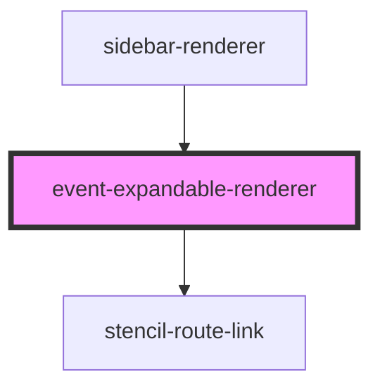

# event-expandable-renderer

<!-- Auto Generated Below -->

## Properties

| Property           | Attribute           | Description | Type            | Default     |
| ------------------ | ------------------- | ----------- | --------------- | ----------- |
| `active`           | `active`            |             | `boolean`       | `undefined` |
| `firstMenuChild`   | `first-menu-child`  |             | `any`           | `undefined` |
| `history`          | --                  |             | `RouterHistory` | `undefined` |
| `item`             | `item`              |             | `any`           | `undefined` |
| `somethingChanged` | `something-changed` |             | `boolean`       | `false`     |
| `url`              | `url`               |             | `any`           | `undefined` |

## Dependencies

### Used by

 - [sidebar-renderer](../sidebar-renderer)

### Depends on

- stencil-route-link

### Graph

----------------------------------------------

*Built with [StencilJS](https://stenciljs.com/)*
