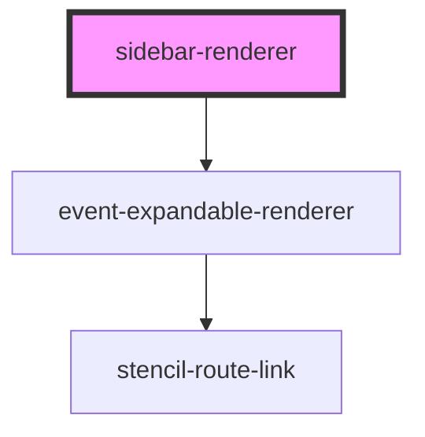

# sidebar-renderer

<!-- Auto Generated Below -->

## Properties

| Property      | Attribute      | Description | Type                             | Default     |
| ------------- | -------------- | ----------- | -------------------------------- | ----------- |
| `active`      | `active`       |             | `boolean`                        | `undefined` |
| `historyType` | `history-type` |             | `"browser" \| "hash" \| "query"` | `undefined` |
| `value`       | --             |             | `MenuItem`                       | `undefined` |

## Dependencies

### Depends on

- [event-expandable-renderer](../event-expdable-renderer)

### Graph

----------------------------------------------

*Built with [StencilJS](https://stenciljs.com/)*
