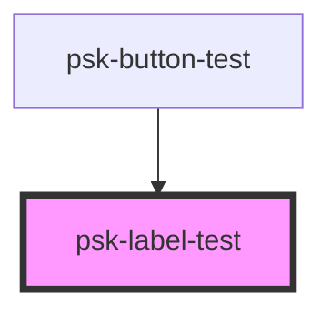

# psk-label-test

<!-- Auto Generated Below -->

## Properties

| Property      | Attribute        | Description | Type  | Default     |
| ------------- | ---------------- | ----------- | ----- | ----------- |
| `firstlabel`  | `first-label`    |             | `any` | `undefined` |
| `labelValue`  | `cosmin-ursache` |             | `any` | `undefined` |
| `secondLabel` | `second-label`   |             | `any` | `undefined` |
| `thirdLabel`  | `third-label`    |             | `any` | `undefined` |

## Dependencies

### Used by

 - [psk-button-test](.)

### Graph

----------------------------------------------

*Built with [StencilJS](https://stenciljs.com/)*
